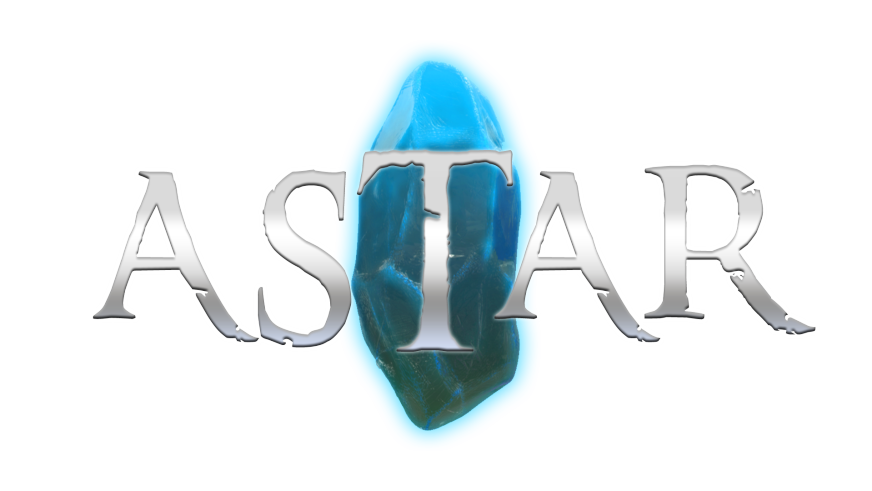
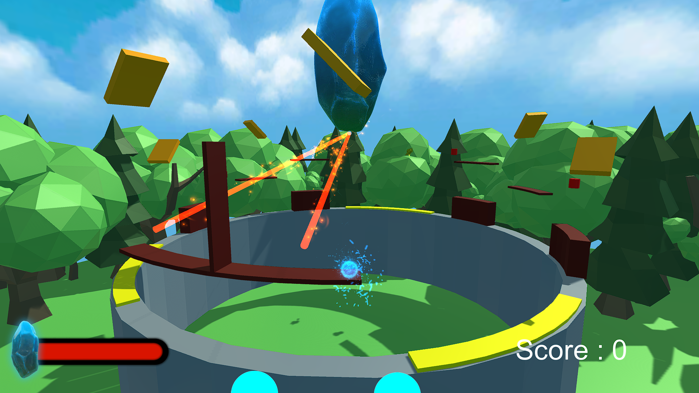
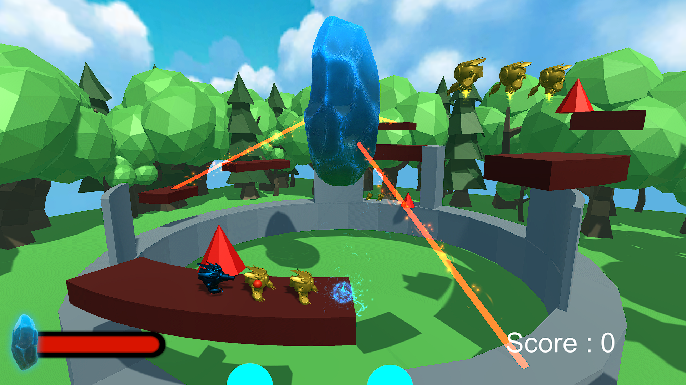
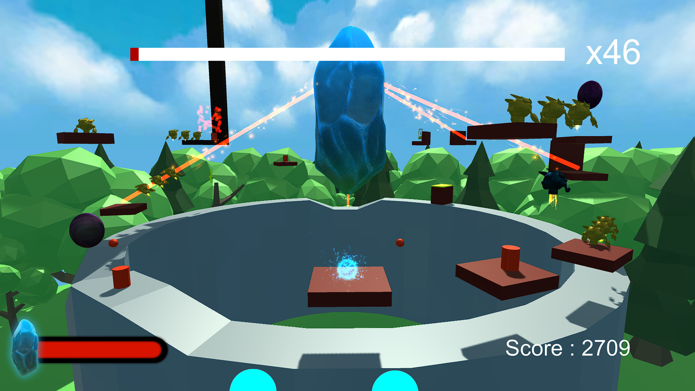

# Astar
Astar is a 2.5D action platform game made as a student project in 5 weeks

    

     
     
     
    

## Description
Astar is a 2.5D action platform game.
You are tasked to protect the ancient crystal from an army of evil machines.
Kill your ennemies and destroy the bridges to stop them.

## Control
The game can be played with a controller or on keyboard.
The player can use a PS4 or Xbox controller and a QWERTY or AZERTY keyboard.
He can set his controller type in the Option Menu.

| Input                 | Action                |
|-----------------------|-----------------------|
| Left face button      | Attack                |
| Bottom face button    | Jump                  |
| Left joystick         | Move                  |
| Right/Left shoulder   | Dash                  |

## My work
In the project I was in charge of : 
    - The controls and interaction of the main character
    - All interactive object : bumber, portal, boost, jumpable wall
    - The path system that the enemies use
    - Level management
    - Save system
    - Credit Scene

## Credits
| Game Designer
|---------------------------|
| BERKANI Yacine            |
| DESCAMPS Célien           |
| MAZUIR Oscar              |
| PALA Flavio               |
| SARAZIN Gaspard           |
| TRINQUET Roséanne         |

| Game Programmer
|---------------------------|
| NARDONE William           |
| NOVO Steeven              |
| PETIT Denis               |
